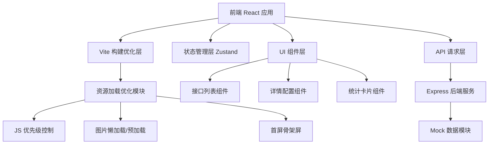
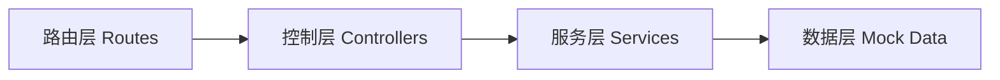

## 1. 架构设计



## 2. 技术说明
- 前端：React@18 + TypeScript + Tailwind CSS@3 + Vite@5 + Zustand
- 后端：Express@4 + TypeScript
- 图标库：lucide-react
- 构建工具：Vite（代码分割、资源压缩、预加载配置）
- 数据：后端 Mock 数据，模拟接口配置信息

## 3. 路由定义
| 路由 | 用途 |
|-------|---------|
| / | 接口配置首页（列表 + 统计 + 筛选） |
| /api/:id | 接口详情配置页 |

## 4. API 定义

### 类型定义
```typescript
interface ApiConfig {
  id: string;
  name: string;
  path: string;
  method: 'GET' | 'POST' | 'PUT' | 'DELETE' | 'PATCH';
  status: 'active' | 'inactive' | 'error';
  description: string;
  headers: KeyValue[];
  queryParams: KeyValue[];
  requestBody?: string;
  responseExample: string;
  createdAt: string;
  updatedAt: string;
}

interface KeyValue {
  key: string;
  value: string;
  required?: boolean;
}

interface Stats {
  total: number;
  active: number;
  inactive: number;
  error: number;
}
```

### 接口列表
| 方法 | 路径 | 描述 |
|------|------|------|
| GET | /api/configs | 获取接口配置列表（支持搜索、筛选） |
| GET | /api/configs/:id | 获取单个接口配置详情 |
| POST | /api/configs | 创建新接口配置 |
| PUT | /api/configs/:id | 更新接口配置 |
| DELETE | /api/configs/:id | 删除接口配置 |
| GET | /api/stats | 获取接口统计数据 |

## 5. 服务端架构



## 6. 性能优化实现方案

### 6.1 JS 加载优先级
- Vite 配置 manualChunks 进行代码分割（react、react-dom、业务代码分离）
- 关键首屏脚本使用 modulepreload 预加载
- 非首屏组件使用 React.lazy + Suspense 按需加载
- 在 index.html 中对关键脚本使用 preload

### 6.2 图片加载优化
- 首屏 Logo/图标使用 preload 预加载
- 列表图片使用 loading="lazy" 懒加载
- 使用 fetchpriority="high" 标记首屏关键图片
- 响应式图片 srcset + sizes 配置

### 6.3 首屏渲染优化
- CSS 关键路径内联到 index.html
- 字体使用 font-display: swap 预加载
- 骨架屏组件在首屏同步渲染
- 使用 React 18 startTransition 标记非紧急更新
